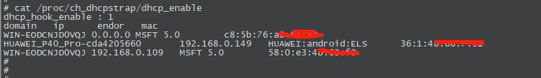

# hookdhcp
if you want to get sta's ip|vendor|hostname|mac in your network. you could try it. it is a tiny process to hook dhcp request. and parse options to get sta's ip|hostname|vendor and so on.

##how to use
you can enable this hook when it is insmod in your kernel. it is enabled by default.
```
echo 1 >  /proc/ch_dhcpstrap/dhcp_enable
```
you can get sta infos in kernel's proc system if your network have dhcp request.

